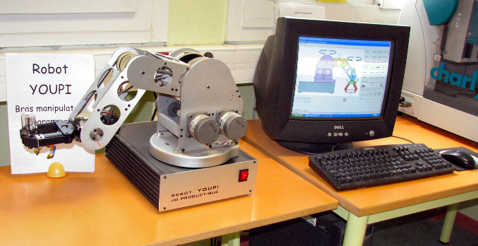
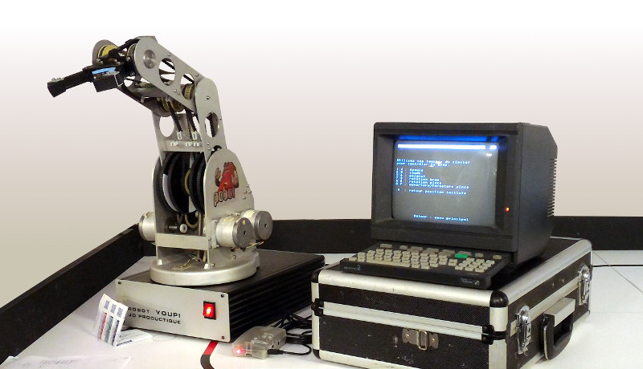
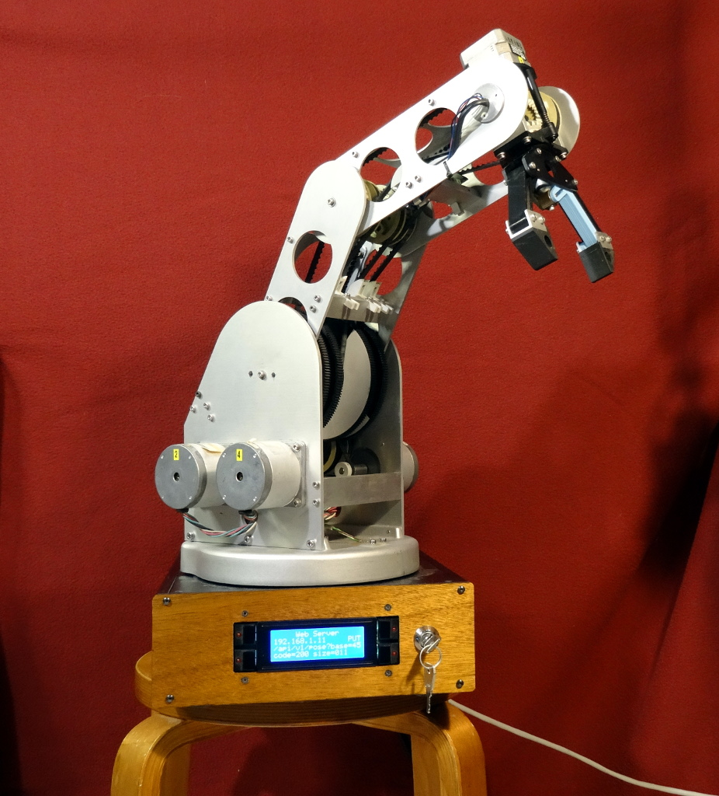

Content
=======

A library for controlling a Youpi robotic arm.

The Genesis
===========

The origins
-----------

The Youpi robotic arm is an educational tool which has been distributed in France
during the early 80ies for teaching the basics of robotics in technology oriented classes.

It was supposed to be controlled by a personal computer built by the French maker
Thomson, which was one of the providers of the Education National Administration in these old ages.
The communication link between them was achieved by a DB25 interface, exposing the raw signals
for stepping the 6 motors contained in the arm. The control software was a proprietary one,
targeting for this computer only.

For more detail about Youpi : `<http://youpi.forler.ch/>`_ (French)

One copy of this arm has been donated to `POBOT association <http://www.pobot.org>`_ by a teacher,
since it was no more used (nor usable) for years and thus was taking place in his lab for nothing.
He gave it to us as a source of mechanical spare parts in his mind.

However, since we cannot bear destroying something that could possibly still work, we have
first developed an interface connected on the DB25 port for generating the proper signals
based on commands sent on a serial link. This has been done with an Arduino for the hardware
part, and the protocol used by the `Dynamixel servos <http://www.robotis.com/xe/dynamixel_en>`_
for the communication layer.

Complemented with a Raspberry Pi implementing a `Videotex <https://en.wikipedia.org/wiki/Videotex>`_ server,
this has resulted in a 80ies flavoured `demonstrator <http://www.pobot.org/Le-mariage-des-annees-80-et-2010.html>`_
presented during the French national scientific event (`Fête de la Science <http://www.fetedelascience.fr/>`_).

The modern days
---------------

As a sequel to the first demonstration presented above, a completely redesigned version of the arm
has been developed.

The original electronic board, based on a complex assembly logical circuits for the logic and and
on bipolar power transistors for driving the motors has been replaced by modern solutions, such as the
`STMicroelectronic L6470 <http://www.st.com/content/st_com/en/products/motor-drivers/stepper-motor-drivers/l6470.html>`_
(aka dSPIN) smart stepper driver and the Raspberry Pi for the control layer.

In addition, a control panel composed of a
`serial I2C 4x20 character LCD <https://www.robot-electronics.co.uk/htm/Lcd05tech.htm>`_,
 a small keypad with signaling LEDs equipped keys and a lock key switch has been added.
 It is used as the user interface for the shell control
program in charge of supervising the whole system and managing the independant applications implementing
various services (automated demonstration, manual control, Web sercices REST API,...).

The package
===========

It provides the library layer exposing various high-level configuration and control methods
for using the arm in any type of application.

Dependencies
============

- `pybot-core <https://github.com/pobot-pybot/pybot-youpi2>`_
- `pybot-dspin <https://github.com/pobot-pybot/pybot-dspin>`_
- `pybot-lcd-fuse <https://github.com/pobot-pybot/pybot-lcd-fuse>`_
