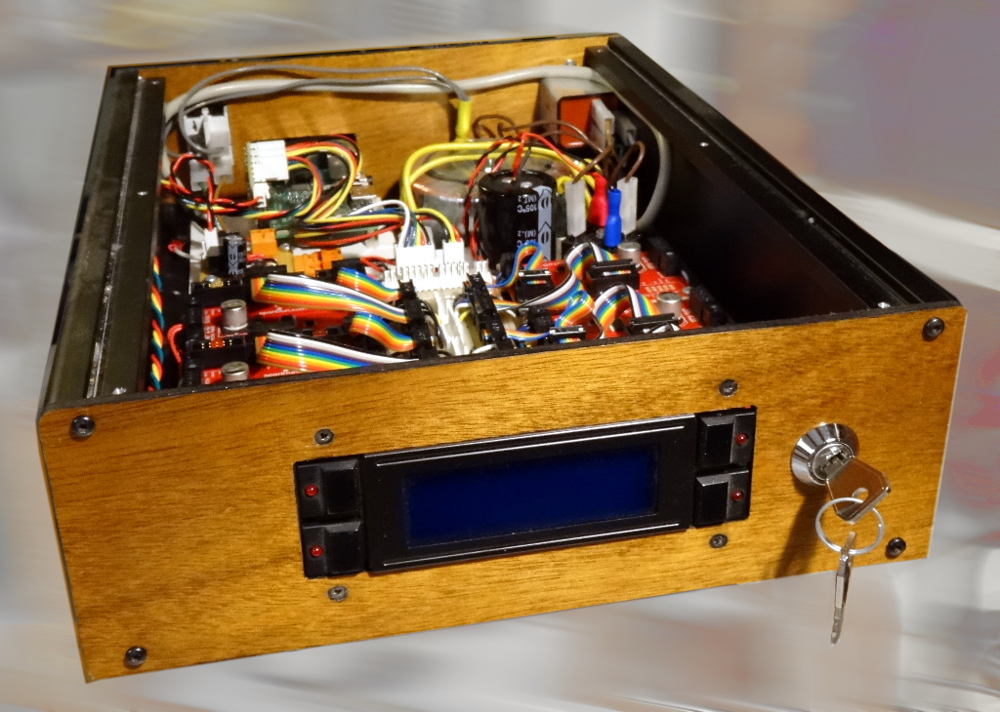

``pybot.youpi2.ctlpanel`` package
=================================

Youpi2 control panel is composed of :

* a serial/I2C 4x20 characters LCD,
* a 4 keys keypad, surrounding the LCD sides,
* 4 LEDs (one per key)
* a key-switch for locking the keypad

************************************
``pybot.youpi2.ctlpanel.api`` module
************************************

.. automodule:: pybot.youpi2.ctlpanel.api
    :members:
    :show-inheritance:

``pybot.youpi2.ctlpanel.widgets`` module
****************************************

.. automodule:: pybot.youpi2.ctlpanel.widgets
    :members:
    :show-inheritance:

*************************************
``pybot.youpi2.ctlpanel.keys`` module
*************************************

.. automodule:: pybot.youpi2.ctlpanel.keys
    :members:
    :show-inheritance:
